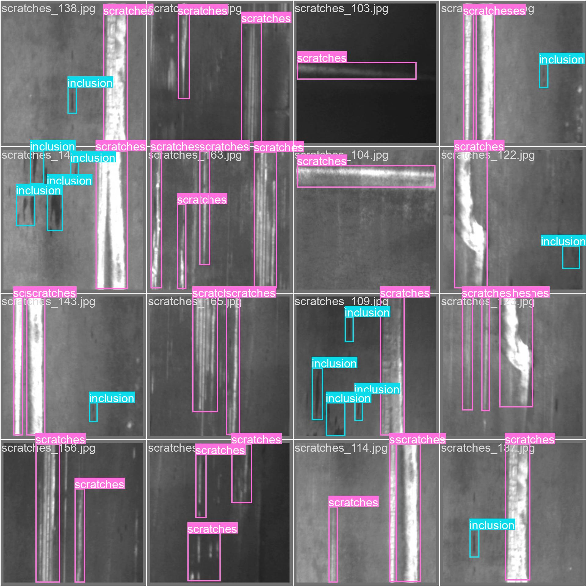
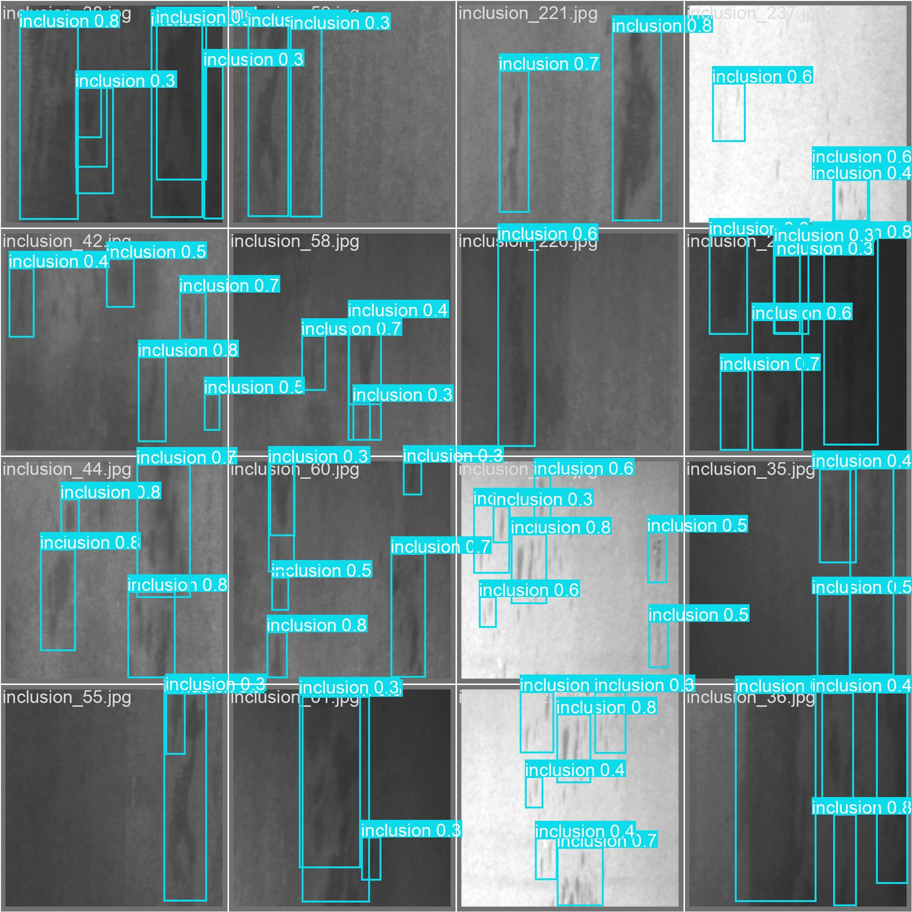
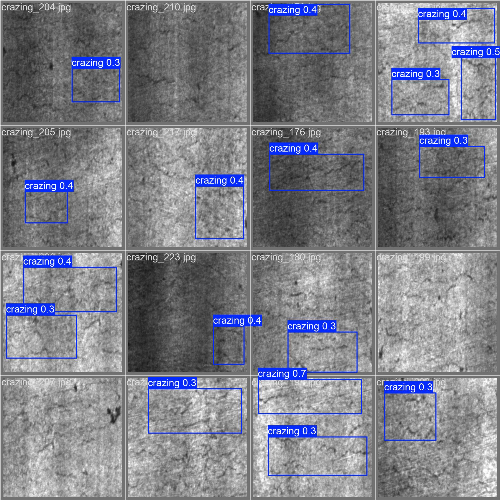

# Computer Vision for Surface Defect Detection

**Smart Manufacturing**

**Problem:** Automating visual inspection on production lines to replace manual Quality Control (QC).

**Result:** Achieved 98.5% mAP in classifying common industrial defects like scratches and dents.

Scratches

Inclusion

Crazing

- Applied Data Augmentation techniques (rotation, brightness, noise addition) to improve model robustness on a limited dataset.
- Utilized Transfer Learning with a pre-trained YOLOv8 model to accelerate training time and improve accuracy.
- Exported the trained model to ONNX format to optimize inference speed, integrating it into a basic Flask REST API.
- GitHub Repository: https://github.com/illumaelkant/Computer-Vision-for-Surface-Defect-Detection
